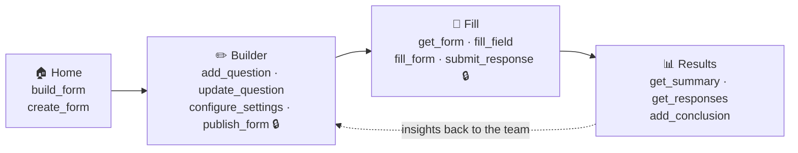

<div align="center">


# **Fieldset**

### Agent-native forms, built on WebMCP

Forms you and your AI agent **build, fill, and analyze together** — same page, same controls,
with everything the agent touches highlighted, so you always see who did what.

**Built using WebMCP.**

[](https://webmcp.devpost.com/)
[](#how-webmcp-is-implemented)
[](https://nextjs.org)
[](https://www.typescriptlang.org)
[](./LICENSE)

**[🌐 Live demo](https://fieldset-dusky.vercel.app/)** ·
**[🎥 Demo video](https://youtu.be/a14pC-tR_mE)** ·
**[🏆 WebMCP Challenge](https://webmcp.devpost.com/)**

</div>

## 🔗 Links

| | |
|---|---|
| 🌐 **Live demo** | https://fieldset-dusky.vercel.app/ |
| 🎥 **Demo video (<3 min)** | https://youtu.be/a14pC-tR_mE |
| 💻 **Source** | https://github.com/schezfaz/fieldset |

> Open the live demo in **ChatGPT's in-app browser** or **Google Chrome with WebMCP enabled**
> (`chrome://flags/#enable-webmcp-testing`). The home page shows a live "WebMCP detected" dot.

---

## Why this is a strong fit for WebMCP

Forms are the web's most universal collaborative surface — and the most tedious. Building,
filling, and reading them are three separate chores, each full of repetitive clicking and
typing. WebMCP is a natural fit because a form *is* a set of controls, and WebMCP lets an agent
operate those exact controls **on the live page a human is already looking at** — not in a
detached chat with its own hidden copy. Fieldset exposes the whole form lifecycle — **build →
fill → analyze** — as WebMCP tools, so the agent and the human act on one shared artifact.

## How it creates a better user experience

- The agent works **with** you, in the open. Everything an agent touches is **highlighted** on
  the page, so you always see who did what — and can correct it by hand, same controls, same canvas.
- Mutating actions (`publish_form`, `submit_response`) are **confirmation-gated** — nothing is
  published or submitted behind your back. Reads are annotated `readOnlyHint`.
- It feels like collaborating with a teammate on a shared doc, not delegating to a black box.

## What people + agents can do together that wasn't possible before

- **Build together:** describe a form in a sentence; the agent assembles it live while you tweak
  questions by hand on the same page.
- **Fill for you, grounded in the real schema:** the agent reads the actual form (`get_form`) and
  fills valid values — no hallucinated fields — while you watch and confirm.
- **Analyze in place:** the agent reads responses and posts its conclusion **onto the results
  page**, where teammates already are, marked as agent-authored.
- **Mixed rooms:** one form filled by a human on one device and an agent on another — multiple
  humans *and* agents converging on a single shared form.

## How WebMCP is implemented

Each page registers its own WebMCP tools through a `useWebMCP` React hook (`lib/webmcp.ts`).
Tools carry JSON-Schema inputs, reads use `readOnlyHint`, and writes route through a shared
`confirmGate`. Conditional questions (e.g. cuisine → mains) resolve their options live from
another answer.



<sub>🔒 = confirmation-gated (mutating) tools. Reads are annotated `readOnlyHint`.</sub>

| Page | WebMCP tools |
|---|---|
| **Home** `/` | `build_form`, `create_form` |
| **Builder** `/edit/[id]` | `get_form_schema`, `add_question`, `update_question`, `remove_question`, `reorder_questions`, `set_form_details`, `configure_settings`, `publish_form` |
| **Fill** `/f/[id]` | `get_form`, `fill_field`, `fill_form`, `get_validation_state`, `submit_response` |
| **Results** `/r/[id]` | `get_summary`, `get_responses`, `add_conclusion` |

**18 tools across the full lifecycle** — build, fill, and analyze.

---

## ▶️ Live workflows — try it yourself

Open the [live demo](#-links) in ChatGPT's in-app browser or Chrome+WebMCP, then drive it with
your agent using these copy-paste prompts.

### 🍕 Send a group order to your agent to fill
1. On the home page, click **Group party food order** — it publishes and opens the fill page.
2. Hand it to your agent:
   > *"Fill out this group food order for me — I want Indian: butter chicken, medium spice,
   > budget around $25. Flag that I'm allergic to nuts, and add garlic bread as a side."*
3. Watch each field populate and **glow blue** (agent-touched) as it goes. The "which main(s)"
   options resolve live from the cuisine you picked. Then:
   > *"Submit it."*

   The agent calls `submit_response`, which **asks you to confirm** before anything is recorded.

### 🛠️ Build a form from one sentence
On the home page:
> *"Build a sign-up form for Friday's team lunch — ask for their name, whether they're coming,
> their entrée choice, any dietary needs, and how many guests they're bringing."*

The agent calls `build_form` and the form appears on the page. Tweak a question by hand, then:
> *"Publish it."* → `publish_form` (confirm-gated) gives you a shareable link.

### 📊 Analyze the responses
On a form's **Results** page (`/r/[id]`):
> *"Summarize the responses so far and post a conclusion on the page."*

The agent reads with `get_summary` / `get_responses`, then posts its takeaway with
`add_conclusion` — rendered on the page, marked as agent-authored.

---

## Tech stack

- **Next.js (App Router)** + React + TypeScript
- **WebMCP** for the agent-facing tool layer
- **Upstash Redis** for persistence (in-memory fallback for local dev)
- Deployed on **Vercel**

## Run locally

```bash
cd web
npm install
npm run dev        # http://localhost:3000
```

Persistence is optional for local dev — without Redis it uses an in-memory store. To persist,
set either pair of env vars (Upstash REST, or Vercel KV's equivalent):

```bash
UPSTASH_REDIS_REST_URL=...
UPSTASH_REDIS_REST_TOKEN=...
# or
KV_REST_API_URL=...
KV_REST_API_TOKEN=...
```

To drive it with an agent, enable WebMCP in Chrome (`chrome://flags/#enable-webmcp-testing`)
or open the site in ChatGPT's in-app browser.

## License

[MIT](./LICENSE) © 2026 Schezeen Fazulbhoy
